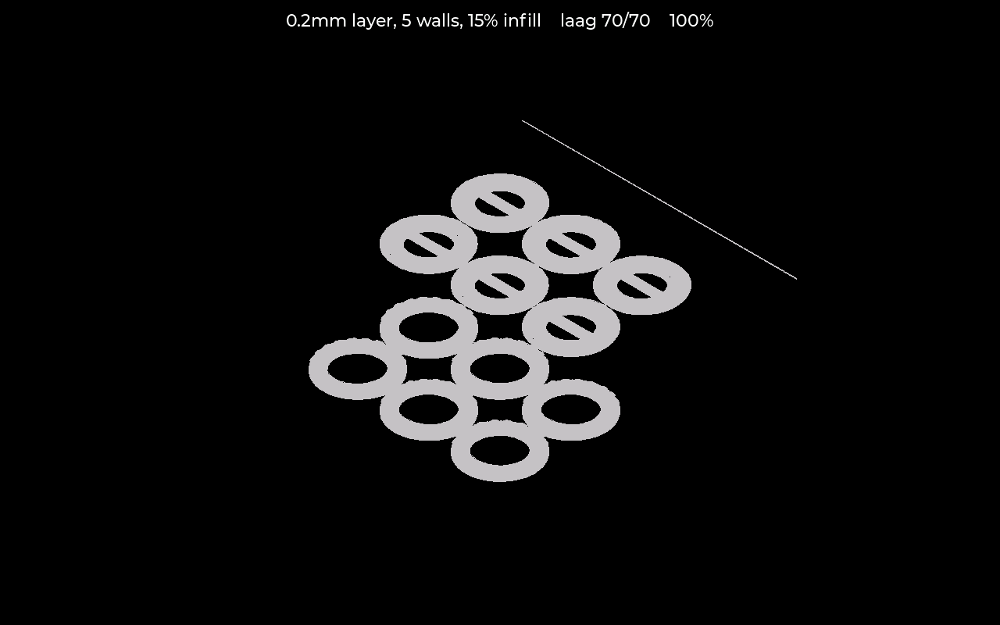

# Printward für Bambu Lab

[English](README.md) · [Nederlands](README.nl.md) · **Deutsch**

Ein eigenständiges **Bedien‑ und Überwachungspanel für einen Bambu Lab 3D‑Drucker**, das auf einem
**Android‑Tablet** läuft — dazu eine vollständige Weboberfläche, sodass du den Drucker vom Tablet
oder von jedem Browser in deinem Netzwerk aus steuern kannst. Eine begleitende **Printward Scale**
(Waage) ergänzt echtes Spulengewicht‑Tracking. Siehe [Hardware](#hardware).

> Im Leerlauf wird das Tablet zum Bildschirmschoner, der den laufenden Druck Schicht für
> Schicht aus dem G‑Code aufbaut:

Die Oberfläche gibt es in **Englisch, Niederländisch und Deutsch**, im laufenden Betrieb
umschaltbar, und weitere Sprachen lassen sich durch das Ablegen einer Datei hinzufügen — siehe
[`lang/`](lang/).

> **Installieren?** Siehe **[INSTALL.de.md](INSTALL.de.md)** — die Tablet-App ist ein APK zum
> Herunterladen und Antippen, und die Waage flasht du direkt im Browser auf
> [der Flasher-Seite](https://sankeeye.github.io/Printward/scale/). Keine Entwickler-Tools nötig.

## Funktionen

- **Live‑Druckerstatus & ‑steuerung** über das **lokale MQTT** des Druckers (der Broker im Drucker
  selbst, im Netzwerk mit dem LAN‑Zugangscode erreichbar — funktioniert auch im normalen
  Cloud‑Modus des Druckers, kein *"LAN Only"*‑Modus nötig): Druckfortschritt, Temperaturen und
  Pause/Fortsetzen/Stopp/Licht‑Steuerung.
- **Filament‑ / AMS‑ & Spulengewicht‑Tracking**: verbleibende Gramm, die während eines Drucks
  herunterzählen, plus die Kosten pro Druck. Keine Zusatzhardware nötig — siehe den Filamentmanager
  weiter unten.
- **Dateibrowser** über den **FTP**‑Dienst des Druckers.
- **Bambu‑Cloud‑Integration** für das Eine, das das lokale MQTT nie preisgibt: wie viel Gramm ein
  abgeschlossener Druck tatsächlich verbraucht hat.
- **LVGL‑Touch‑UI** (LVGL 9.3): Druckerbildschirm, Filament/AMS, Dateibrowser, Einstellungen.
- **Einrichtung am Bildschirm** für die Druckerverbindung (IP / Seriennummer / LAN‑Zugangscode).

Im **Android‑Tablet‑ / Web‑Build** zusätzlich:

- **Manuelles Bewegen** ("Move"): X/Y/Z verfahren, Referenzfahrt, Extrudieren/Zurückziehen und —
  im LAN‑Modus — Temperatur‑Presets.
- **Volle Websteuerung** auf `:8080`, die jeden Tablet‑Bildschirm spiegelt (Übersicht, Filament,
  Dateien, Bewegen, Waage, Spulen, Einstellungen), **passwortgeschützt und nur im eigenen
  Netzwerk erreichbar**.
- **Filamentmanager (keine Waage nötig)**: eine Spulenbibliothek (anlegen/bearbeiten/kopieren/
  suchen/Sammelbearbeitung). Gib das Gewicht einer Spule ein und die verbleibenden Gramm zählen
  während eines Drucks live herunter (Gesamtmenge aus der gesliceten Datei × Fortschritt), mit
  Preis / Kosten / Restwert und einer Warnung *"reicht das Filament für diesen Druck?"*. Die
  optionale **Printward Scale** lässt dich wiegen statt tippen — und für den exakten Wert neu
  wiegen — während das Bambu‑Cloud‑Relay (unten) die echten Gramm pro Druck liefern kann, damit es
  auch ohne Waage stimmt.
- **ntfy‑Benachrichtigungen** (Druck fertig/fehlgeschlagen, Filament knapp), **Druckverlauf &
  Statistik** und Kiosk‑Neustart nach einem Absturz.

> **Hinweis — Temperatur & Druck starten.** Bei neuerer Bambu‑Firmware (≥ 01.08) weist der Drucker
> *Temperatur setzen* und *Druck starten* von Drittanbieter‑Tools ab, sofern er nicht im **LAN
> Only**‑Modus ist. Printward hat einen **LAN‑Modus**‑Schalter (Einstellungen ▸ Drucker einrichten):
> aktiviere ihn, wenn dein Drucker auf LAN Only steht, und die Temperaturregler sowie der Druckstart
> erscheinen. Im normalen Cloud‑Modus lässt du ihn aus und startest Drucke über Bambu Studio /
> Handy — alles andere hier (Überwachung, Pause/Stopp, Licht, Bewegen/Jog, AMS‑Einstellungen)
> funktioniert ohnehin.

## Hardware

- **Android‑Tablet** — führt die LVGL‑UI (`src/ui_*`) als eigenständige Drucker‑Überwachung/
  ‑Steuerung mit einer Live‑Verbindung über lokales MQTT zum Drucker aus, **plus eine vollständige
  Web‑UI** auf `http://<tablet>:8080`. Verifiziert auf einem Samsung SM‑T280 (Android 5.1.1).
  Siehe [`android/README.md`](android/README.md).
- **Printward Scale** — eine ESP32‑S3‑ + HX711‑Wägezellen‑Waage (die SpoolEase‑Scale‑Hardware,
  geflasht mit unserer eigenen Firmware), die echte Spulengewichte an das Tablet liefert für
  Filament‑Tracking, Kosten und Filament‑Warnungen. Siehe [`scale/`](scale/).

Entwickelt und getestet an einem **Bambu Lab P1S**. Printward spricht mit dem Drucker über die
lokale **MQTT‑ + FTP**‑Schnittstelle, die Bambu‑Lab‑Drucker gemeinsam haben, daher sollten auch
andere Modelle (P1P, X1C, A1, …) funktionieren — sie wurden hier nur noch nicht getestet.

Genau derselbe `src/ui_*`‑Code baut auch als **PC‑Simulator** (`sim/`) für die Entwicklung.

## Aus dem Quellcode bauen (für Entwickler)

*Willst du es einfach nur nutzen? Dann brauchst du das nicht — siehe **[INSTALL.md](INSTALL.md)**.
Dieser Abschnitt ist zum Selbst‑Bauen der App und Firmware.*

- **Android‑Tablet** — baue das APK mit dem Android NDK + Gradle und spiele es aufs Tablet. Die
  vollständige Schritt‑für‑Schritt‑Anleitung steht in [`android/README.md`](android/README.md).
  Drucker‑IP / Seriennummer / LAN‑Zugangscode kommen in `/sdcard/printward.conf` (siehe
  `sim/android/printward.conf.example`) oder über die **Drucker einrichten** am Bildschirm.
- **Printward Scale** — öffne `scale/` in **VS Code** mit der **PlatformIO**‑Erweiterung und flashe
  über **USB‑C** (Umgebung `printward_scale`). WLAN‑Einrichtung beim ersten Start und die
  Kalibrierung der Wägezelle sind in `scale/` beschrieben.

## Sicherheit

Die Weboberfläche steuert einen echten Drucker, deshalb steht sie nicht offen:

- **Passwort.** Das Tablet erzeugt beim ersten Start ein zufälliges Passwort und zeigt es unter
  **Einstellungen ▸ Web‑Passwort** — wie ein Fernseher einen Kopplungscode zeigt, sodass es kein
  Standardpasswort gibt, das man zu ändern vergisst, und jedes Gerät sein eigenes bekommt. Melde
  dich als Benutzer `printward` an.
- **Nur lokales Netzwerk.** Der Server lehnt Verbindungen von außerhalb deines eigenen Netzwerks ab,
  sodass eine weitergeleitete Portfreigabe oder UPnP den Drucker nicht ins Internet stellen kann.
- Der LAN‑Zugangscode des Druckers bleibt auf dem Tablet (in `/sdcard/printward.conf`) und ist nie
  in einer Sicherung enthalten oder über die Weboberfläche sichtbar.

Es ist einfaches HTTP, das Passwort geht also unverschlüsselt über dein eigenes Netzwerk — genug,
um den Drucker vom Internet und von anderen Geräten im WLAN fernzuhalten, kein Schutz gegen jemanden,
der aktiv deinen Netzwerkverkehr mitliest.

## Filament‑Gewicht‑Relay (`tools/`)

Der Login von Bambu Cloud steckt hinter Cloudflares Bot‑Schutz, daher läuft stattdessen ein
kleines Python‑Helferlein auf deinem PC: es meldet sich bei Bambu Cloud an, verfolgt deinen
Druckverlauf und meldet dem Tablet über dein Netzwerk die Gramm, die jeder abgeschlossene Druck
verbraucht hat.

Einrichten:

1. `pip install requests`
2. Kopiere `tools/config.example.json` nach `tools/config.json` und trage deine Daten ein
   (Bambu‑E‑Mail, Drucker‑Seriennummer, IP, Port und Web‑Passwort des Tablets - Einstellungen > Web‑Passwort). `config.json` und `relay_state.json`
   sind git‑ignoriert — sie enthalten deine Zugangsdaten/Token und müssen lokal bleiben.
3. Starte es: `python tools/bambu_weight_relay.py` — lass es während des Druckens laufen.

Hinweise:

- **Bestätigungscode**: etwa alle 90 Tage braucht ein neuer Login einen 6‑stelligen Code per
  E‑Mail; das Relay fragt ihn im Terminal ab, starte es also zum ersten Login mit sichtbarer Konsole.
- **Windows‑Komfort**: `encrypt_password.bat` speichert dein Passwort verschlüsselt
  (`bambu_password_enc`, per Windows‑DPAPI an dein Konto gebunden) statt im Klartext;
  `start_relay_hidden.vbs` startet das Relay ohne Konsolenfenster. Beides ist optional und nur für
  Windows — unter Linux/macOS nutzt du einfach ein `bambu_password` im Klartext in deiner
  (git‑ignorierten) `config.json` oder ein `custom_token`.

## Wie es entstand

Printward begann als Firmware für ein kleines ESP32‑Handpanel — ein Ort, um zu sehen, was der
Drucker gerade tat, ohne Bambu Studio auf einem Laptop zu öffnen. Es funktionierte, aber die
Hardware wurde am Ende zum begrenzenden Faktor, und ein altes Android‑Tablet erledigte dieselbe
Aufgabe besser: ein größerer Bildschirm, WLAN, um das sich das Betriebssystem schon kümmert, und
Raum zum Wachsen.

Und wachsen tat es — das Interessante war nicht noch eine Statusanzeige. Es war die Frage, die in
der Werkstatt wirklich aufkommt: *wie viel Filament ist noch auf dieser Spule, und was hat mich
dieser Druck gekostet?* Das ehrlich zu beantworten braucht echte Gewichte, keine Prozent‑Schätzung,
also kam ein zweites Gerät dazu: ein ESP32‑S3 mit einer Wägezelle — die Printward Scale. Daraus
entstanden die Spulenbibliothek, die Kosten pro Druck, der Verlauf und die Statistik.

Die ESP32‑Firmware wurde inzwischen entfernt. Übrig bleiben die Tablet‑App, ihre Weboberfläche und
die Waage.

## Dank

- Aufgebaut auf LVGL und SDL sowie den in `platformio.ini` aufgeführten Open‑Source‑Bibliotheken.

## Lizenz

**GNU AGPL-3.0** — siehe [LICENSE](LICENSE). Copyright © 2026 sankeeye.

Freie Software: nutzen, studieren, teilen, verbessern. Wer sie aber verbreitet — oder eine
geänderte Version als Netzwerkdienst betreibt — muss den Quellcode unter derselben Lizenz
freigeben. Kurz: sie bleibt offen, und niemand kann daraus ein geschlossenes Bezahlprodukt machen.

Die AGPL deckt den Code ab, **nicht den Namen „Printward"** oder das Branding. Nutze den Namen
oder das Logo nicht, um zu suggerieren, dein Fork, Produkt oder Dienst sei offiziell oder von
diesem Projekt unterstützt — forke frei, aber gib deiner Version einen eigenen Namen.
